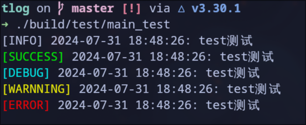

[](https://raw.githubusercontent.com/suoyuan666/tlog/master/LICENSE)
[](README_ZH_CN.md)

## Introduction

tlog is a C++ library for outputting RGB color log information in the terminal.

C++ Standard: C++ 17

## Usage

Add this directory to CMakeLists.txt and use `target_link_libraries()` to link `tlog`.

You can refer to the test program source file in the test directory

```cpp
#include <tlog.h>

auto main() -> int {
  tlog::tprint({"test", "测试"}, tlog::tlog_status::INFO, tlog::NO_LOG_FILE);
  tlog::tprint({"test", "测试"}, tlog::tlog_status::SUCCESS, tlog::NO_LOG_FILE);
  tlog::tprint({"test", "测试"}, tlog::tlog_status::DEBUG, tlog::NO_LOG_FILE);
  tlog::tprint({"test", "测试"}, tlog::tlog_status::WARNNING, tlog::NO_LOG_FILE);
  tlog::tprint({"test", "测试"}, tlog::tlog_status::ERROR, tlog::NO_LOG_FILE);
  return 0;

```

The first parameter of `tlog::tprint()` is the value to be output, which is a `std::initializer_list<std::string_view>` class. The second parameter is the level of the message. tlog provides five levels: `SUCCESS`, `INFO`, `DEBUG`, `WARNNING` and `ERROR`. The third parameter is used to indicate the content of the log file where the log information is saved. By default, two are provided: `tlog::NO_LOG_FILE` and `tlog::DEFAULT_LOG_FILE`. The former is set to not generate a log file, and the latter is a default log file path **/tmp/tlog.log**.

demo:



## Development

When compiling a project with CMake, you can add `-DTLOG_DEV_TEST=ON` to add test cases. If you use [Visual Studio Code](https://code.visualstudio.com/) to develop, I have added this setting to **.vscode/settings.json**. You only need to install the [CMake Tools](https://github.com/microsoft/vscode-cmake-tools) plugin to use it.